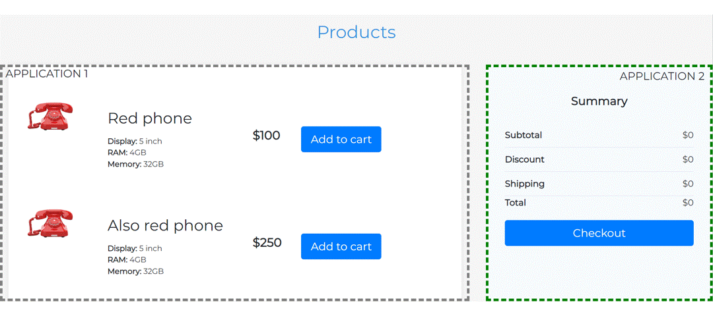

# Microfrontend communication

Establish easy-to-use communication channel between two different microfronetnds designed as separate custom web components.

Widget types:
* **shopping cart** - contains summary of expected user purchase
* **products list** - list of products to browse

User can move product inside shopping cart directly from products list, but applications have to be separated, so no direct access to shopping cart is possible.



## Communication types covered:
* using global `window` object as mediator
* using `redux-micro-frontend` library as communication gateway between redux stores

## Running application

To start application with Nx use the following command:

```
npx nx run host-application:serve
```
-----

<a alt="Nx logo" href="https://nx.dev" target="_blank" rel="noreferrer"></a>

✨ **This workspace has been generated by [Nx, a Smart, fast and extensible build system.](https://nx.dev)** ✨
